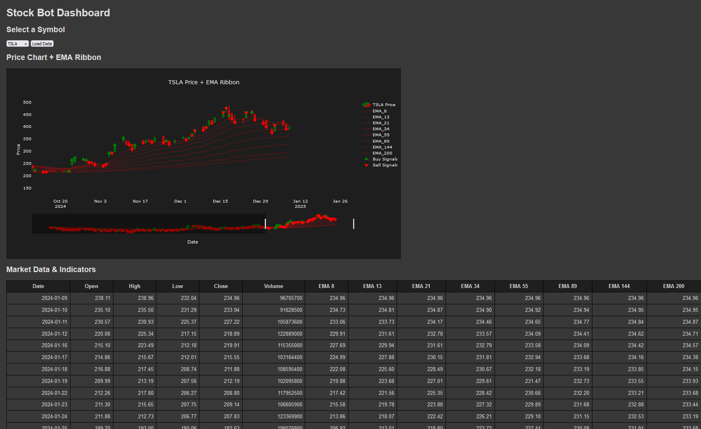

# Stock Bot Dashboard

## Project Overview

The **Stock Bot Dashboard** is a comprehensive tool designed to help users analyze stock performance and trading signals. The application provides interactive visualizations, technical indicators, and AI-driven insights to enhance decision-making in stock trading. Future plans include integrating sentiment analysis and more advanced machine learning models.

---
### Dashboard View


---

## Features

### Current Functionality
1. **Symbol Selection**:
   - A dropdown menu allows users to select from a list of available stock symbols.
2. **Interactive Chart**:
   - Displays stock price candlesticks.
   - Includes a fully integrated EMA (Exponential Moving Average) Ribbon for trend analysis.
   - Shows **Buy** and **Sell** signals generated by the KNN (K-Nearest Neighbors) AI model.
   - Recently added **VWAP (Volume-Weighted Average Price)** for enhanced price tracking.
3. **Market Data Table**:
   - Lists daily open, high, low, close prices, volume, EMA values, VWAP, and AI-generated trading signals (Buy, Sell, Hold).
4. **AI-Driven Insights**:
   - Uses a KNN model to generate Buy/Sell/Hold predictions.
   - Predictions are dynamically loaded and visualized on the chart and table.

### Future Enhancements
- **Sentiment Analysis**:
  - Incorporate Twitter, news APIs, and other sentiment data to refine AI predictions.
- **Advanced Machine Learning Models**:
  - Explore models like Random Forest, XGBoost, and deep learning for trading signals.
- **Automated Backtesting**:
  - Allow users to evaluate strategy performance over historical data.

---

## Screenshots


## Technical Details

### Backend
- **Flask**:
  - Provides RESTful API endpoints for fetching market data and AI predictions.
- **SQLite**:
  - Stores historical stock data and computed indicators.
- **Python Libraries**:
  - `yfinance`: Fetches historical stock data.
  - `pandas`: Data manipulation and indicator calculations.
  - `scikit-learn`: Trains and serves the KNN model for Buy/Sell predictions.

### Frontend
- **HTML/CSS/JavaScript**:
  - Interactive UI for selecting stocks, viewing charts, and analyzing data.
- **Plotly.js**:
  - Renders the candlestick chart with EMA Ribbon, VWAP, and Buy/Sell indicators.
- **Dynamic Table Rendering**:
  - Displays detailed market data with AI-generated signals.


## Setup Instructions

1. **Clone the Repository**:
   ```bash
   git clone https://github.com/your-repo/Stock-Bot.git
   cd stock-bot-dashboard
   ```

2. **Install Dependencies**:
   - Backend:
     ```bash
     pip install -r requirements.txt
     ```
   - Frontend:
     Ensure you include Plotly.js in your HTML file.

3. **Database Setup**:
   - Ensure `historical_data.db` exists in the `data/` directory.
   - Run `data_fetch.py` to populate data for tickers listed in `tickers.csv`.

4. **Run the Application**:
   ```bash
   python app.py
   ```

5. **Access the Dashboard**:
   Open your browser and navigate to:
  http://127.0.0.1:5000/
  


## API Endpoints

### `/api/symbols`
Returns a list of available stock symbols.

### `/api/market-data/<symbol>`
Returns daily market data, technical indicators, and Buy/Sell/Hold signals for a given stock symbol.

### `/api/knn-signals/<symbol>`
Returns Buy/Sell signals for the selected stock based on the KNN model.


## Contributing

Feel free to fork the repository and submit pull requests for new features or bug fixes. Suggestions for improvements are always welcome!


## License

This project is licensed under the MIT License.
